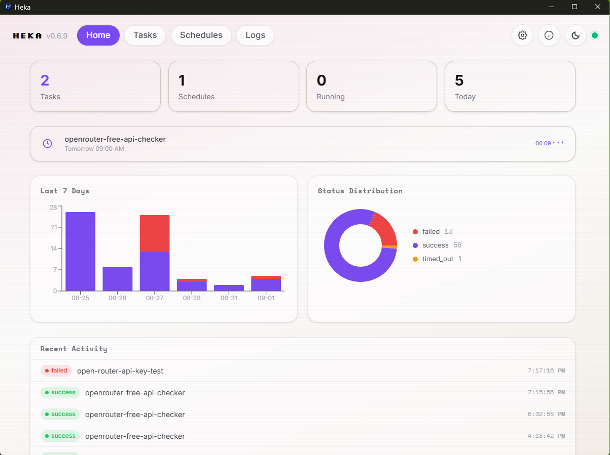
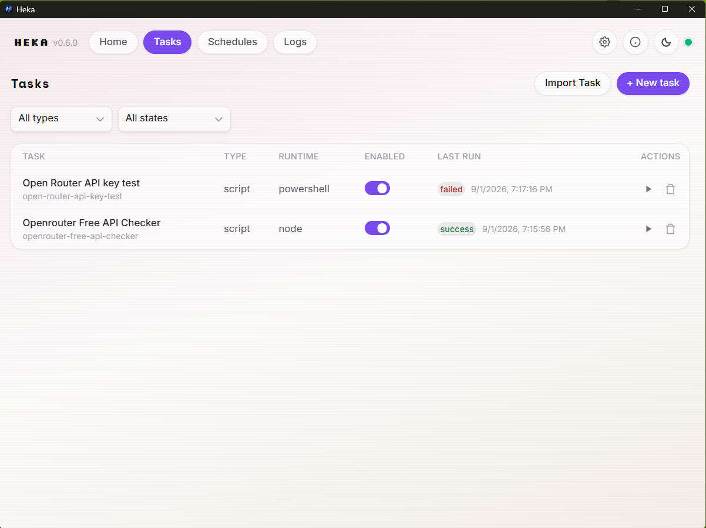
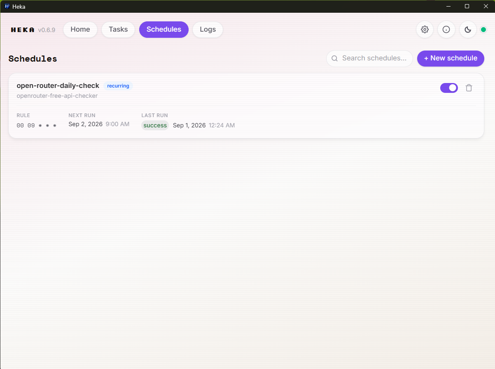
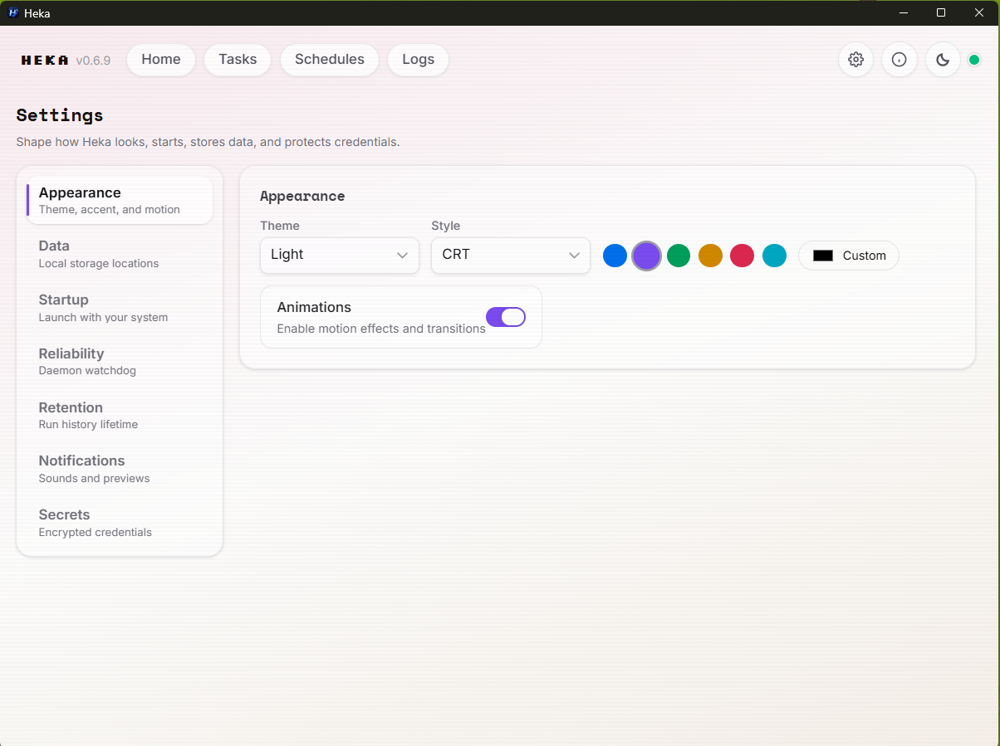

<p align="center">
  
</p>

<h1 align="center">Heka</h1>

<p align="center"><strong>A local task runner and scheduler for programmers — built for AI agents.</strong></p>

Heka is a single desktop app: a persistent background daemon that schedules and runs
your scripts and native executables, plus a polished GUI and a terminal CLI to manage
them. The daemon keeps working after you close the window — tasks run on time, every
time, whether or not anyone is watching.

Tasks are plain YAML files, versioned, portable, and easy to inspect or generate.
Everything is local-first: no account, no cloud, no internet required.

## Screenshots

<table>
  <tr>
    <td align="center"><strong>Dashboard</strong><br></td>
    <td align="center"><strong>Tasks</strong><br></td>
  </tr>
  <tr>
    <td align="center"><strong>Schedules</strong><br></td>
    <td align="center"><strong>Settings</strong><br></td>
  </tr>
</table>

## Features

- **Persistent daemon + system tray** — schedules and executes in the background; the
  GUI is just a window onto it. Close it and Heka keeps running.
- **Run anything** — PowerShell, Python, Node, Bash, custom runtimes, or native
  binaries. Heka never cares what the script does.
- **Schedules** — cron expressions and one-time jobs, with next/last run tracking and
  a configurable missed-run policy.
- **Visual editor + YAML** — build tasks in forms or edit canonical YAML in a
  CodeMirror editor; both stay in sync. Import/export keeps tasks portable.
- **Full control** — run now, cancel, timeouts, retries, concurrent tasks with
  no self-overlap.
- **History & logs** — every run recorded (SQLite + per-run artifact folders) with
  stdout/stderr, exit code, and duration.
- **Secret vault** — credentials encrypted at rest (AES-256-GCM); tasks reference
  them as `${KEY}` and values never leave your machine.
- **Notifications** — desktop toasts (with sounds) plus webhooks to Slack, Discord,
  Pumble/Telegram, or any HTTP endpoint; per-task `notify_on` control.
- **Insight dashboard** — stat tiles, next-run, 7-day chart, status donut, recent
  activity; plus dedicated logs, schedules, and run-detail views.
- **Agent-ready CLI** — list, run, status, logs, enable/disable, schedules, and
  daemon management. Every command accepts `--json` for machine-readable output.
- **Local-only IPC** — named pipe / unix socket, SQLite storage, no network listener
  by default.
- **Runs with the OS** — optional startup registration and a watchdog that restarts
  the daemon; installers for Windows (NSIS), Linux (DEB), and macOS (DMG).

## Use cases — for humans

- **Personal automation** — a script that runs daily at 08:00 while you work.
- **Backups & monitoring** — scheduled filesystem backups, health checks, log cleanup.
- **CI-like jobs** — run tests or builds on your own machine before pushing.
- **System administration** — recurring maintenance tasks that just happen.

## Use cases — for AI agents

Heka is designed to be driven programmatically. An agent can trigger a task by slug,
poll its status, and read its output — all with stable JSON.

```bash
heka run daily-research --json
# {"success":true,"slug":"daily-research","run_id":"01J...","status":"queued"}

heka status daily-research --json
# {"success":true,"slug":"daily-research","enabled":true,"last_run":{...}}

heka logs daily-research --json
# {"success":true,"slug":"daily-research","run":{...}}
```

Tasks are YAML, so agents can also create, edit, and validate them directly:

```yaml
version: 1
name: Daily Research
slug: daily-research
type: script
runtime: powershell
script: ./scripts/research.ps1
timeout: 300
capture_output: true
```

See the About page in the app for the full CLI reference and a downloadable agent
skill file.

---

Built with [Wails](https://wails.io/) · [GitHub](https://github.com/AHS12/heka)
