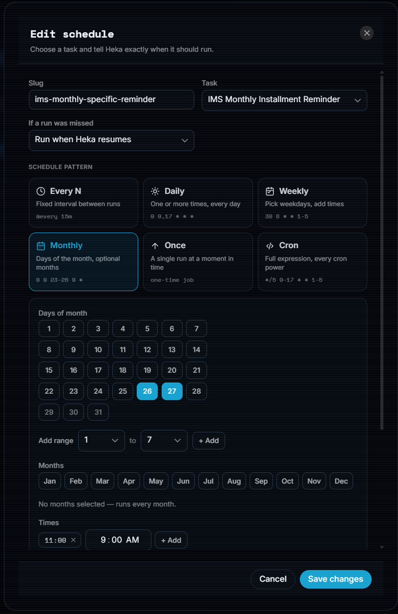

<p align="center">
  
</p>

<h1 align="center">Heka</h1>

<p align="center">
  <a href="https://github.com/AHS12/heka/releases">
    
  </a>
  <a href="https://github.com/AHS12/heka/stargazers">
    
  </a>
  <a href="https://github.com/AHS12/heka/releases">
    
  </a>
</p>

<p align="center"><strong>Simple script &amp; binary automation made easy.</strong></p>

<p align="center">
A local task runner and scheduler for scripts and commands,<br>
with first-class agentic support through the CLI.<br>
No cloud. No accounts. No cron homework required.
</p>

---

You have scripts that should just run. Backups, cleanups, health checks, reports,
deploys. Cron is cryptic. Task Scheduler is buried three dialogs deep. Cloud
automation wants your data — and a credit card.

Heka is the missing middle: a desktop app where you point at anything your
computer can run, say *when* it should run, and get on with your day. It sits
quietly in your system tray, runs your tasks on time, catches up after sleep,
and shows you exactly what happened — no more wondering whether that backup
actually ran last night.

The whole product fits on an index card:

| Question                | Answer               |
| ----------------------- | -------------------- |
| *What should happen?*   | **Create a task**    |
| *When should it happen?*| **Create a schedule**|
| *What happened?*        | **Check the dashboard, logs** |

## Screenshots

<table>
  <tr>
    <td align="center" width="40%"><strong>Dashboard</strong><br></td>
    <td align="center" width="40%"><strong>Tasks</strong><br></td>
    <td align="center" rowspan="2" width="20%"><strong>Schedule builder</strong><br></td>
  </tr>
  <tr>
    <td align="center"><strong>Schedules</strong><br></td>
    <td align="center"><strong>Settings</strong><br></td>
  </tr>
</table>

## Why Heka

**Scheduling that finally makes sense.**

- **Real cron power, zero cron homework.** Pick days of the month from a grid,
  select a range like "the 23rd through the 26th", restrict to specific months,
  or fire at several times a day. Heka writes the expression and shows you the
  next five runs live, in plain English. Experts can type raw cron whenever
  they want — every standard feature is supported.
- **Your PC sleeps. Heka catches up.** Tasks missed while the machine was off
  or asleep are detected at startup and wake — and run once, or get recorded
  as skipped, per your policy. No silently dropped runs.
- **One run at a time, by design.** A schedule never stacks a second copy of a
  task on top of a still-running one.
- **One-time jobs too.** A run at a specific future moment — then it disables
  itself.

**Runs anything, reliably.**

- **Any runtime** — PowerShell, Python, Node, Bash, custom interpreters, or
  plain binaries. Heka never cares what the script does.
- **Retries with configurable delay, hard timeouts, and instant cancellation.**
  A flaky network script gets a second chance; a hung one gets stopped.
- **Full capture** — stdout, stderr, exit code, and duration for every run,
  stored as per-run artifact files.

**Yours, locally.**

- **A daemon, not a doer.** Heka schedules and executes in the background;
  the GUI is just a window onto it. Close the window — Heka keeps working.
- **Nothing leaves your machine.** SQLite storage, local-only IPC over a named
  pipe or unix socket, no account, no internet required.
- **Secrets stay secret.** Credentials are encrypted at rest (AES-256-GCM);
  tasks reference them as `${KEY}` and values are never written to disk in
  plain text.
- **Survives reboots.** Optional startup registration and a watchdog that
  restarts the daemon, plus encrypted backups and restore for your Heka data.

**Keeps you informed, everywhere.**

- **Visual editor + YAML.** Build tasks in forms or edit canonical YAML side
  by side — they stay in sync. Import and export keep tasks portable text
  files you can read, diff, and share.
- **Desktop notifications** with sounds, plus webhooks to Slack, Discord,
  Telegram, or any HTTP endpoint — per-task, per-outcome control.
- **A dashboard that answers questions.** Stat tiles, next run, 7-day chart,
  status breakdown, recent activity — plus full run history and logs.
- **Agent-ready CLI.** List, run, status, logs, enable/disable, schedules, and
  daemon management — every command speaks `--json`.

## Simple on the surface, powerful underneath

A beginner needs five minutes:

> Create task → pick script → pick schedule → done.

A programmer keeps discovering, as needed:

> retries → timeouts → secrets → webhooks → YAML → CLI → artifacts

No graphs, no nodes, no pipelines to learn. That's the point.

## Install

Grab the latest installer from
[**Releases**](https://github.com/AHS12/heka/releases) — Windows `.exe`
(NSIS) and macOS `.dmg` (drag to Applications).

### macOS

Open the DMG and drag **Heka** to Applications. The app is ad-hoc signed —
on first launch, if Gatekeeper complains, right-click **Open** once, or run:

```bash
xattr -cr /Applications/Heka.app
```

**Terminal CLI (Herd-style):** enable *Settings → Startup → Terminal CLI* to
put `heka` on your PATH (a symlink in
`~/Library/Application Support/Heka/bin` plus one line in your shell
profile). Then in a **new** terminal:

```bash
heka daemon status
heka run daily-research
```

**Notifications:** the first task notification asks macOS for permission
once — allow it and every toast afterwards carries the Heka icon
(System Settings → Notifications to change later).

**Watchdog guard** (Settings → Reliability): macOS uses launchd — with the
guard on, a crashed daemon is restarted within seconds; a clean
`heka daemon stop` stays down. Combine freely with "Start with system"
(login autostart), which is a separate toggle.

**Uninstall:** stop the daemon first (`heka daemon stop`, or
`heka daemon startup off` if it starts at login), drag Heka.app to the
Trash, then delete the CLI wiring: remove the `# Heka CLI` line from your
shell profile and `rm -rf "$HOME/Library/Application Support/Heka/bin"`.

Or build from source (Go 1.25, Node, and the
[Wails CLI](https://wails.io/docs/gettingstarted/installation) required):

```bash
git clone https://github.com/AHS12/heka.git
cd heka
make build          # → build/bin/Heka.app (macOS) / build/bin/heka.exe (Windows)
```

## Development

Want to build Heka from source or work on it? Here's the whole setup.

**Prerequisites**

- **Go 1.25+**
- **Node.js 20+** (frontend)
- **Wails CLI v2.15.0** — `go install github.com/wailsapp/wails/v2/cmd/wails@v2.15.0`
- Platform toolchain: Xcode Command Line Tools on macOS; WebView2 and
  [NSIS](https://nsis.sourceforge.io/) on Windows (the latter for installers)

```bash
git clone https://github.com/AHS12/heka.git
cd heka
cd frontend && npm install && cd ..
make dev            # daemon + GUI with hot reload (Ctrl-C stops both)
```

**Common commands**

| Command | What it does |
| ------- | ------------ |
| `make dev` | Daemon + GUI together, with hot reload |
| `make test` | Go tests + frontend suite |
| `make check` | Quality gate: vet + lint + tests |
| `make build` | Local app bundle (macOS) / executable (Windows) |

Tasks are plain YAML; edit them in the data directory's `tasks/` folder
(`~/Library/Application Support/heka/tasks` on macOS,
`%LOCALAPPDATA%\heka\tasks` on Windows) or create them in the app. Set
`HEKA_HOME` to put the data directory somewhere else. Releasing and version
bumps are documented in [docs/releasing.md](docs/releasing.md).

## Use cases — for humans

- **Personal automation** — a script that runs daily at 08:00 while you work.
- **Backups & monitoring** — scheduled filesystem backups, health checks, log cleanup.
- **CI-like jobs** — run tests or builds on your own machine before pushing.
- **System administration** — recurring maintenance tasks that just happen.

## Use cases — for AI agents

Heka is designed to be driven programmatically. An agent can trigger a task by
slug, poll its status, and read its output — all with stable JSON:

```bash
heka run daily-research --json
# {"success":true,"slug":"daily-research","run_id":"01J...","status":"queued"}

heka status daily-research --json
# {"success":true,"slug":"daily-research","enabled":true,"last_run":{...}}

heka logs daily-research --json
# {"success":true,"slug":"daily-research","run":{...}}
```

Tasks are plain YAML, so agents can also create, edit, and validate them
directly:

```yaml
version: 1
name: Daily Research
slug: daily-research
type: script
runtime: powershell
script: ./scripts/research.ps1
timeout: 300
```

Need to know what an agent missed while the laptop was shut? It's one command:

```bash
heka schedules missed --json
```

See the About page in the app for the full CLI reference and a downloadable
agent skill file.

---

<p align="center"><em>Your local automation control center.</em></p>

<p align="center">Built with <a href="https://wails.io/">Wails</a></p>
